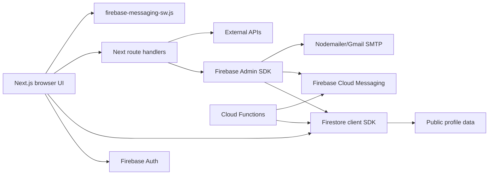

# DSA404 Tracker — Project Documentation and Analysis (PDA)

**Evidence date:** 28 September 2026  
**Repository:** `C:\#Projects\404\404\404dsatracker-tracker`  
**Evidence standard:** This document is derived from the checked-out repository. Product documents are treated as claims; source, configuration, and rules are treated as implementation evidence. “Implemented” means a reachable source path exists, not that an external service is guaranteed to respond.

## 1. Executive Summary

DSA404 Tracker is a Next.js 16 App Router client application for structured DSA practice. Its implemented core is a Firebase-backed personal plan: users authenticate, receive seeded problem days, mark problems complete, write notes, review flagged items, inspect progress, and adjust pace/sheet/reminder settings. The repository also contains a client/server coding-platform adapter layer, contest retrieval, GitHub profile/solution utilities, code execution integration, email/FCM notification paths, guest-mode data, and a public profile surface.

The most important architectural fact is that most application state is client-driven Firestore access under `users/{uid}/...` (`src/lib/db.ts:35-61`); Next.js route handlers are used for integrations and privileged operations. `firestore.rules:35-89` deliberately exposes the root user document and `days` collection publicly for public profiles, while owner-only subcollections hold private settings and notes.

The repository is not internally consistent with all product documents. Examples include README references to `/analytics`, `/cheatsheets`, and `/mock` that are absent from the route tree; PRD/SRS schemas that describe collections such as `plans/{userId}` and `progress/{userId}/problems/{problemId}` while the implementation uses `users/{uid}/days/{stableId}`; and a “18-platform” claim while the registry contains 18 platform IDs only if GitHub and LinkedIn are counted, although the registry constructor registers 16 adapters and does not register GitHub or LinkedIn.

## 2. Evidence, Scope, and Working-Tree Caveat

The request prohibited source modification. Only this PDA file is added. At inspection time `git status --short` showed existing modifications and untracked files in application code, documentation, and generated `functions/lib`; those changes were preserved and not attributed to this analysis. Generated/dependency directories were not semantically audited: `node_modules`, `.next`, `dist`, `build`, compiled `functions/lib`, `package-lock.json`, and `tsconfig.tsbuildinfo` were inventory-listed but not treated as authoritative source. Binary assets were identified by path and type, not decoded line-by-line.

## 3. Project Objectives, Problem Statement, Users, and Scope

### Objectives

- Make daily DSA preparation concrete through seeded days and configurable quotas.
- Persist completion, notes, review flags, schedule changes, and profile information.
- Aggregate selected competitive-programming profiles and contest information.
- Provide an installable responsive web experience with optional reminders.

### Problem and target users

The PRD describes students, working developers, competitive programmers, and recruiters. Source behavior supports the first three directly; recruiter use is represented by public profiles, not a recruiter workflow. The implemented scope is primarily single-user learning management with optional public presentation.

### Scope classification

| Area | Classification | Evidence |
|---|---|---|
| Auth, onboarding, username claim | Implemented | `app/auth/auth-page-content.tsx`, `src/lib/db.ts` |
| Daily plan, sheets, completion, notes | Implemented | `src/lib/plan.ts`, `src/lib/db.ts`, authenticated pages |
| Review flags/reminders | Implemented, but not a full interval engine | `app/(authenticated)/review/page.tsx`, `src/lib/reminders.ts` |
| Progress/streak/badges | Implemented client-side | `app/(authenticated)/progress/page.tsx`, `src/lib/gamification.ts` |
| Platform profiles | Implemented adapters with uneven capability depth | `src/lib/coding-platforms/*` |
| Contest radar | Implemented with external-fetch dependency | `src/lib/contests-service.ts`, `/api/contests` |
| Code execution | Implemented client utility against Judge0/Wandbox | `src/lib/codeCompiler.ts` |
| GitHub solution auto-commit | Implemented utility, client token flow | `src/lib/github-sync.ts` |
| Admin campaigns | Implemented route with token verification and allowlist/role check | `app/api/campaigns/publish/route.ts` |
| AI tutor, analytics route | Prompt/analytics helpers exist; no AI backend is present | `src/lib/aiTutorPrompt.ts`, `/api/coding-platforms/analytics` |
| Offline-first Firestore | Not demonstrated as a configured feature | no `enableIndexedDbPersistence` found |

## 4. Technology Stack and Repository Structure

### Stack confirmed by `package.json`

Next.js `^16.0.0`, React `^19.2.8`, TypeScript `^5.8.3`, Tailwind CSS 4, Firebase client `^12.19.0`, Firebase Admin `^14.2.0` (dev dependency), Firestore/Auth/Storage/Messaging, TanStack Query, Recharts, Radix UI primitives, `xlsx`, `nodemailer`, `zod`, and `lucide-react`.

### Top-level structure

```text
app/                         Next App Router pages, layouts, route handlers
src/components/              Feature UI, charts, modals, shadcn/Radix wrappers
src/hooks/                   Auth, plan, settings, contest, reminder, PWA hooks
src/integrations/firebase/   Client SDK and server Admin SDK helpers
src/lib/                     Domain models, Firestore access, planners, adapters
functions/                   Scheduled/on-delete Firebase Cloud Functions source
scripts/                     Sheet/data/build/maintenance tooling
public/                      Manifest, service worker, icons, downloadable sheets
README.md / PRD.md / SRS.md / COMPLETE_FEATURES_DOCUMENTATION.md
                             Product and architecture claims; not all are current
```

## 5. System Architecture



```mermaid
sequenceDiagram
  participant U as User
  participant A as Auth UI
  participant FA as Firebase Auth
  participant D as Firestore
  U->>A: Sign up/sign in or guest mode
  A->>FA: Email/password or Google credential
  FA-->>A: Auth user / ID token
  A->>D: Ensure users/{uid}; claim usernames/{username}
  A->>D: Seed settings and plan days
  D-->>A: User plan and profile
  A-->>U: /today
```

```mermaid
flowchart TD
  T[/today] --> Load[usePlan loads days]
  Load --> Select[Select active day by date/status]
  Select --> Solve[Mark problem done, note, review, code]
  Solve --> Persist[Firestore users/{uid}/days/{stableId}]
  Persist --> Metrics[Progress, streak, heatmap, review views]
  Solve --> GitHub[Optional client-side GitHub commit]
```

```mermaid
flowchart LR
  Input[Profile URL or platform+username] --> Detect[detector.ts]
  Detect --> Registry[Platform registry]
  Registry --> Adapter[Adapter fetchProfile]
  Adapter --> Normalize[NormalizedCodingProfile]
  Normalize --> Cache[In-memory cache]
  Cache --> UI[Profile dashboard]
  UI --> Analytics[/api/coding-platforms/analytics]
```

```mermaid
flowchart TD
  Cron[Vercel/HTTP cron] --> Verify[Optional CRON_SECRET check]
  Verify --> Users[Query users settings]
  Users --> Due[Timezone and reminder windows]
  Due --> Push[FCM multicast]
  Due --> Mail[SMTP email]
  Due --> Topic[users/{uid}/reminders]
  Push --> Tokens[Prune invalid tokens]
```

```mermaid
erDiagram
  USERS ||--o{ DAYS : owns
  USERS ||--|| SETTINGS : has
  USERS ||--|| PRIVATE_PROFILE : has
  USERS ||--o{ REVISION_EVENTS : records
  USERS ||--o{ PUSH_SUBSCRIPTIONS : registers
  USERS ||--o{ REMINDERS : schedules
  USERS ||--o{ USERNAMES : claims
  USERS ||--o{ ACHIEVEMENTS : future
  USERS ||--o{ CONTEST_REMINDER_SENT : tracks
  USERS { string uid PK; string displayName; string bio; object codingProfiles; object publicStats }
  DAYS { string id PK; number dayNumber; string date; string status; array problems; array checklist }
  SETTINGS { string prefs PK; number dailyTarget; string timezone; boolean paused }
  PRIVATE_PROFILE { string profile PK; string notes }
  USERNAMES { string username PK; string uid }
```

## 6. Authentication and Authorization

`app/auth/auth-page-content.tsx:39-410` validates email with Zod, supports email/password and Google popup, resolves username login by reading `usernames/{normalized}` then obtaining the mapped account email, supports password reset, and offers guest mode. `src/hooks/useAuth.tsx:9-37` subscribes to `onAuthStateChanged`; guest mode is a local-storage abstraction from `src/lib/guest-data.ts`. `app/(authenticated)/layout.tsx:1-127` redirects unauthenticated users to `/auth?next=...` and wraps signed-in content in `AppShell`, `PlanProvider`, and settings/reminder providers.

The Admin SDK in `src/integrations/firebase/admin.server.ts` is server-only and verifies Firebase ID tokens. Privileged routes should use `Authorization: Bearer <ID token>`. `firestore.rules` is the primary data authorization boundary for client reads/writes. Root user documents and days are world-readable by design; all writes remain owner-only.

## 7. Routes and Pages

### Route inventory

| URL | File | Auth | Main behavior |
|---|---|---:|---|
| `/` | `app/page.tsx` | No | Landing/demo entry, guest/demo affordances, install prompts |
| `/auth` | `app/auth/page.tsx` + `auth-page-content.tsx` | No | Sign in, sign up, Google, reset initiation, guest mode |
| `/reset-password` | `app/reset-password/page.tsx` | No | Firebase password reset completion UI |
| `/today` | `app/(authenticated)/today/page.tsx` | Yes | `MergedTodayProfile` daily workspace |
| `/problems` | `app/(authenticated)/problems/page.tsx` | Yes | Search/filter/sort/page curated problem bank |
| `/topics` | `app/(authenticated)/topics/page.tsx` | Yes | Topic explorer, skip/restore, problem views |
| `/weeks` | `app/(authenticated)/weeks/page.tsx` | Yes | Week/month/all roadmap grouping |
| `/progress` | `app/(authenticated)/progress/page.tsx` | Yes | KPIs, streaks, charts, badges, plan events |
| `/review` | `app/(authenticated)/review/page.tsx` | Yes | `forReview` problems and topic reminders |
| `/backlog` | `app/(authenticated)/backlog/page.tsx` | Yes | Incomplete past days and catch-up controls |
| `/day/[dayNumber]` | `app/(authenticated)/day/[dayNumber]/page.tsx` | Yes | Deep link to a plan day; currently minimal page wrapper |
| `/contests` | `app/(authenticated)/contests/page.tsx` | Yes | Contest sections and attendance/actions |
| `/profile` | `app/(authenticated)/profile/page.tsx` | Yes | Owner coder profile |
| `/profile/[uid]` | `app/profile/[uid]/page.tsx` | No | Public profile by UID; docs also claim username URLs, but the implementation parameter is named `uid` |
| `/editor` | `app/(authenticated)/editor/page.tsx` | Yes | Local saved submissions and code execution UI |
| `/messages` | `app/(authenticated)/messages/page.tsx` | Yes | Broadcast list; admin campaign composer |
| `/settings` | `app/(authenticated)/settings/page.tsx` | Yes | Pace, sheet, reminders, theme, account, GitHub settings |

Missing despite documentation claims: `/analytics`, `/cheatsheets`, `/mock`, and a distinct `/profile/[username]` route. Public files include a static `404.html`; it is not an App Router page.

### API route inventory

| Endpoint | Method | Auth | Evidence and behavior |
|---|---|---:|---|
| `/api/coding-platforms` | GET | None in handler | `input`/`url` or `platform`+`username`; detector; one profile; 400 missing input |
| `/api/coding-platforms` | POST | None in handler | Array or record of profiles; batch adapter sync; 400 empty, 500 exception |
| `/api/coding-platforms/analytics` | POST | None in handler | Body `profiles`; normalized analytics; 500 exception |
| `/api/contests` | GET | None in handler | `force=true`; sync/read contest data; public cache headers |
| `/api/send-email` | POST | None in handler | Body `email`, `subject`, `message`; Nodemailer; 400 missing email |
| `/api/send-email/onboarding` | POST | None in handler | Registration-triggered email path; utility-backed |
| `/api/push/test` | POST | Firebase ID token | Verifies token, reads caller tokens, sends FCM multicast, prunes invalid tokens |
| `/api/campaigns/publish` | POST | Firebase ID token + admin | Role `admin` or allowlisted email; writes message; broadcasts all push tokens |
| `/api/cron/send-reminders` | GET | Cron secret behavior in route | Reads settings/reminders and sends morning/evening/contest/topic/quote notifications |

Security note: `/api/coding-platforms`, `/api/coding-platforms/analytics`, `/api/send-email`, and `/api/contests` do not perform application authentication in their route handlers. External adapter abuse/rate limiting is therefore a deployment concern.

## 8. File Inventory

The following is the complete semantic inventory of repository-owned source/config/data files. Repetitive Radix wrappers are grouped but each file is named.

### App Router and pages

| Files | Responsibility / exports |
|---|---|
| `app/layout.tsx`, `app/providers.tsx` | Root metadata, viewport, anti-FOUC theme script, QueryClient, theme, in-app browser, toaster |
| `app/page.tsx` | Landing/demo home; exports `Home` |
| `app/globals.css`, `app/theme-customizer-context.tsx`, `app/theme-customizer-panel.tsx` | Global styles; theme state, presets, font/size/view persistence and controls |
| `app/auth/page.tsx`, `app/auth/auth-page-content.tsx` | Auth shell and full auth flow |
| `app/reset-password/page.tsx` | Reset route shell |
| `app/profile/[uid]/page.tsx` | Public profile loader and renderer |
| `app/(authenticated)/layout.tsx` | Auth guard and authenticated dependency composition |
| `app/(authenticated)/today/page.tsx` | Daily page wrapper |
| `app/(authenticated)/problems/page.tsx` | Problem bank state/filter rendering |
| `topics/page.tsx`, `weeks/page.tsx`, `progress/page.tsx`, `review/page.tsx`, `backlog/page.tsx` | Topic, roadmap, metrics, review, backlog features |
| `day/[dayNumber]/page.tsx`, `contests/page.tsx`, `profile/page.tsx`, `editor/page.tsx`, `messages/page.tsx`, `settings/page.tsx` | Deep day, contests, owner profile, editor, announcements, settings |

### Hooks

| File | Contract and behavior |
|---|---|
| `useAuth.tsx` | Auth subscription, guest fallback, sign out |
| `usePlan.tsx` | `PlanProvider` and `usePlan`; loads/seeds/rebalances plan, mutations and plan metadata |
| `useProblemCompletions.tsx` | Completion/code/submission persistence facade |
| `useSettings.tsx` | Firestore/local guest settings context and theme synchronization |
| `useContests.tsx` | React Query contest fetch, status classification, user marks |
| `useTopicReminders.ts` | Reminder CRUD facade |
| `usePWAInstall.ts` | `beforeinstallprompt` capture and install prompt |
| `use-mobile.tsx` | Media-query mobile detection |
| `useInactivityLogout.ts` | Idle timeout sign-out |

### Domain libraries and services

| Area | Files | Responsibility |
|---|---|---|
| Firebase | `client.ts`, `admin.server.ts`, `auth-attacher.ts`, `auth-middleware.ts` | SDK initialization, emulators, messaging, Admin token verification/data deletion; the last two are empty marker modules |
| Plan/data | `types.ts`, `plan.ts`, `db.ts`, `settings.ts`, `problems.ts`, `master-problems.ts`, `practice-problems.ts`, `extra-problems-data.ts`, `a2z-data.ts`, `sheets-data.ts`, `guest-data.ts` | Models, schedule generation, Firestore persistence, normalization, bundled data, guest persistence |
| User/product | `profileService.ts`, `userActivity.ts`, `gamification.ts`, `reminders.ts`, `error-capture.ts`, `error-page.ts`, `lovable-error-reporting.ts`, `utils.ts`, `aiTutorPrompt.ts` | Profiles/stats/activity, badges, reminders, error/reporting helpers, formatting, generated ChatGPT URLs |
| Integrations | `contests-service.ts`, `contest-platform-linker.ts`, `github-sync.ts`, `codeCompiler.ts`, `email.ts`, `push.ts` | Contest fetch/cache, links, GitHub API, Judge0/Wandbox, SMTP, FCM/browser notifications |
| Platform hub | `types.ts`, `registry.ts`, `detector.ts`, `capabilities.ts`, `normalizer.ts`, `cache.ts`, `sync-engine.ts`, `client-api.ts`, `analytics.ts`, `errors.ts` plus adapter files | Adapter contract, URL detection, capability matrix, normalization/cache/sync/analytics |

### React components

Feature components: `AppShell`, `HomePage`, `MergedTodayProfile`, `DayDetail`, `DayCard`, `DayDetailModal`, `ProblemRow`, `ProblemCardHorizontal`, `CodeModal`, `CodeChefCompilerModal`, `SkippedTopicSolveModal`, `SolvedProblemsArchive`, `OnboardingModal`, `ResetPasswordContent`, `PasswordInput`, `UserMenu`, `ConfirmDialog`, `QuoteLoader`, `HoverHint`, `DemoHelperBanner`, `DemoShell`, `ReminderRunner`, `TopicReminderSection`, `NotificationPanel`, `GlobalSearchModal`, `GitHubRepoLinkModal`, `GitHubContributionHeatmap`, `SubmissionHeatmap`, `LeetCodeCalendarWidget`, `BadgesGrid`, `UserProgressChart`, `WeeklyBarChart`, `ContestsSection`, `ContestsPlatformBar`, `InstallApkSection`, `ChromeInstallModal`, `ThemeToggle`, `SocialIcons`.

Coding-profile components: `CoderProfilePage`; `coding-profiles/ContestHistoryChart`, `DifficultyBreakdown`, `PlatformActivityHeatmap`, `PlatformConnectCard`, `PlatformHeatmapModal`, `PlatformProfileCard`, `UnifiedProfileDashboard`.

UI primitives: `src/components/ui/accordion.tsx`, `alert-dialog.tsx`, `alert.tsx`, `aspect-ratio.tsx`, `avatar.tsx`, `badge.tsx`, `breadcrumb.tsx`, `button.tsx`, `calendar.tsx`, `card.tsx`, `carousel.tsx`, `chart.tsx`, `checkbox.tsx`, `collapsible.tsx`, `command.tsx`, `context-menu.tsx`, `dialog.tsx`, `drawer.tsx`, `dropdown-menu.tsx`, `form.tsx`, `hover-card.tsx`, `input-otp.tsx`, `input.tsx`, `label.tsx`, `menubar.tsx`, `navigation-menu.tsx`, `pagination.tsx`, `popover.tsx`, `progress.tsx`, `radio-group.tsx`, `resizable.tsx`, `scroll-area.tsx`, `select.tsx`, `separator.tsx`, `sheet.tsx`, `sidebar.tsx`, `skeleton.tsx`, `slider.tsx`, `sonner.tsx`, `switch.tsx`, `table.tsx`, `tabs.tsx`, `textarea.tsx`, `toggle-group.tsx`, `toggle.tsx`, `tooltip.tsx`. These are thin Radix/shadcn-style wrappers and are not individually re-explained as domain logic.

### Adapter inventory

Registered in `src/lib/coding-platforms/registry.ts`: LeetCode, Codeforces, CodeChef, AtCoder, HackerRank, GFG, Codewars, HackerEarth, Code360, InterviewBit, CSES, SPOJ, Topcoder, Kattis, Exercism, Kaggle. Adapter files also exist for `github.ts` and `linkedin.ts`, and their types/capabilities are defined, but the constructor does not register them; they are therefore present but not reachable through normal registry sync.

### Scripts and data/assets

Scripts: `build_full_docs.js`, `build-all-sheets.mjs`, `check-links.mjs`, `compile-sheets-ts.mjs`, `core404_data.json`, `data/{love_babbar,neetcode150,rising_brains,striver_a2z,striver_sde}.json`, `excel-helper.mjs`, `generate-{love-babbar,neetcode,rising-brains,sheets-data,striver-a2z,striver-sde}.mjs`, `patch-tailwind-nullbyte.mjs`, `purge-old-problems-firestore.ts`, `sheet-helpers.mjs`.

Static assets: `public/404.html`, icons/logos/placeholders, `manifest.json`, `robots.txt`, `firebase-messaging-sw.js`, and six downloadable sheets in `public/sheets/`. Root and public copies of Core404 PDF/XLSX exist. The PDFs/XLSX are data artifacts, not executable source.

Configuration: `.firebaserc`, `firebase.json`, `firestore.rules`, `firestore.indexes.json`, `next.config.mjs`, `tsconfig.json`, `postcss.config.mjs`, `eslint.config.js`, `components.json`, `bunfig.toml`, `vercel.json`, `package.json`, `functions/package.json`, `functions/tsconfig.json`, `.gitignore`, `AGENTS.md`, `index.html`.

## 9. Database and Firebase Design

### Collections and access

| Path | Document shape / ID | Reads | Writes | Use |
|---|---|---|---|---|
| `users/{uid}` | Public profile, stats, coding handles, completed snapshots; ID = Auth UID | Public | Owner | Profile and public portfolio |
| `users/{uid}/private/profile` | `notes`, timestamps; fixed `profile` ID | Owner | Owner | Private notes |
| `users/{uid}/days/{stableId}` | `Day` fields plus `seqIndex`, `updatedAt`; stable generated ID | Public | Owner | Plan/day state |
| `users/{uid}/meta/plan` | `startDate`, `lastActiveDate`, `lastSyncedAt`, schema metadata in persistence code | Owner | Owner | Plan control |
| `users/{uid}/settings/prefs` | normalized settings fields, timestamps | Owner | Owner | Preferences/reminders |
| `users/{uid}/revisionEvents/{eventId}` | schedule change event snapshots | Owner | Owner | Undo/history |
| `users/{uid}/pushSubscriptions/{tokenId}` | FCM token/device metadata | Owner | Owner/Admin delete | Push delivery |
| `users/{uid}/reminders/{reminderId}` | topic/date/time/note/triggered | Owner | Owner | Topic reminders |
| `users/{uid}/achievements/{code}` | future badge persistence | Owner | Denied client | Reserved |
| `usernames/{username}` | `{uid}`; normalized 3–20 chars | Public | Claiming owner | Username uniqueness |
| `messages/{messageId}` | campaign title/body/url/status/counts | Authenticated | Admin route/Admin SDK | Announcements |
| `contestRemindersSent/{id}` under user | sent markers | Admin route | Admin route | Idempotent contest alerts |

Example sanitized day:

```json
{
  "id": "arrays-core404-1",
  "dayNumber": 1,
  "seqIndex": 0,
  "date": "2026-09-28",
  "section": "Arrays",
  "topic": "Arrays",
  "subtopics": ["Traversal"],
  "problems": [{"name":"Two Sum","difficulty":"Easy","done":false,"platform":"LeetCode","link":"https://leetcode.com/problems/two-sum/","linkVerified":true}],
  "checklist": [{"label":"Understand pattern","done":false}],
  "status": "pending",
  "notes": "",
  "revisionNotes": "",
  "skipped": false
}
```

`firestore.indexes.json` contains no composite indexes. Queries that use `where` plus ordering or collection groups may require Firestore to create indexes at runtime; this is a deployment risk. `firestore.rules` does not expose field-level filtering, so any field added to public `users/{uid}` or `days` is public.

### Firebase flow

`src/integrations/firebase/client.ts` initializes one Firebase app, Auth, Firestore, Storage, and conditional Messaging. It uses demo defaults when the public API key is absent and connects Auth/Firestore emulators on localhost in that mode. `admin.server.ts` creates an Admin app from server env vars, verifies ID tokens, and can delete user subcollections. `functions/src/index.ts` exposes a scheduled reminder function and Auth on-delete cleanup; `functions/lib/index.js` is compiled output.

## 10. Feature Documentation and State Flows

| Feature | Entry/UI | State/data | Current behavior and limitation |
|---|---|---|---|
| Registration/login/logout/reset | `/auth`, `/reset-password` | Firebase Auth; `usernames` | Email/password, Google, username lookup, reset. Username login depends on reading public index. |
| Onboarding | `OnboardingModal`, auth email route | `users`, settings, seeded days | Welcome emails are fire-and-forget fetches; failure does not block account creation. |
| Daily queue/completion | `/today`, `MergedTodayProfile`, `DayDetail` | `users/{uid}/days` | Problem `done` and `completedAt` update; status derives from problems/checklist. |
| Skip/merge/postpone/borrow | Today/topic/week components; `usePlan` | days + revisionEvents | Plan array is transformed then batch-written; stable IDs avoid orphaning after renumber. |
| Notes/intuitions | Day/problem/code modals | day fields and completion snapshots | Notes are persisted through plan mutations; privacy follows day visibility rules. |
| Code editor/compiler | `/editor`, `CodeChefCompilerModal`, `codeCompiler.ts` | local storage/submission hook | Languages: C++, Java, Python, JS, C, Go, Rust. Judge0 primary, Wandbox fallback. External code is sent to third parties. |
| Problem bank/sheets | `/problems`, `/settings` | bundled data and `public/sheets` | Search/filter/sort/pagination; sheets are local assets, not Firestore data. |
| Topics/roadmap | `/topics`, `/weeks` | seeded `Day[]` | Topic skipping compacts schedule; Sunday revision days are generated in planner. |
| Review vault | `/review` | `Problem.forReview`, reminders | Review flag is implemented. PRD interval labels (3/7/14/30) are not represented as a complete persisted interval algorithm. |
| Backlog | `/backlog` | past incomplete days | Displays catch-up and can insert revision buffer; exact behavior is component/usePlan-specific. |
| Progress/streak/badges | `/progress` | derived from days | Current streak/longest streak scan completed days; badges computed client-side and not persisted. |
| Contest radar | `/contests`, `useContests` | `/api/contests`, contest service | External aggregation, status tabs/countdowns, attendance markers; cache headers only on route. |
| Coding profiles | `/profile`, `UnifiedProfileDashboard` | profile doc + adapter results | 16 registered adapters; cache is process-local. Platform capability depth varies. |
| GitHub integration | settings/profile, `github-sync.ts` | local config/token; GitHub API | Client token can create/update files and commits. Token is not stored in Firestore by utility design. |
| Public profile | `/profile/[uid]` | world-readable user/days | Public by UID. Docs claim username URL but route does not resolve username. |
| Search/command palette | `GlobalSearchModal`, `cmdk` | local navigation/problem lists | Global search is UI-local; no server index. |
| Notifications | `NotificationPanel`, `ReminderRunner`, `push.ts` | messages, reminders, FCM tokens | In-app messages and browser/local reminders; server cron provides FCM/email paths. |
| Email | email route, `src/lib/email.ts` | Gmail SMTP env | No auth on generic send-email route; requires deployment-level protection. |
| Theme/personalization | theme context/panel, settings | localStorage + settings | Light/dark/system, presets, custom colors, font, size, forced view. Dynamic Google Fonts are loaded from browser. |
| PWA | manifest, FCM service worker, install hook | browser APIs | Install prompt and push worker assets exist. No configured Workbox/offline Firestore persistence found. |
| Export/backup | XLSX public assets, UI downloads | static files | Sheet downloads are implemented; a general user-data backup/export workflow was not located. |
| Admin/campaign | `/messages`, campaign route | `messages`, FCM | Admin email or `role=admin`; broadcasts all push tokens in batches of 500. |

## 11. Business Logic and Algorithms

### Plan seeding and schedule

`src/lib/plan.ts:210-326` groups sheet sections, allocates days, chunks problems, creates stable IDs, and interleaves Sunday revision days. `renumber()` derives consecutive active dates from array order; skipped days receive negative sequence numbers. `planOffset()` compares an active day’s expected and actual date. Complexity is O(D + P), where D is days and P is problems.

Pseudocode:

```text
sections = selectedSheet.sections
allocation = allocate days by section size/pace
for each section:
  split problems into allocation-sized chunks
  create content day with checklist and metadata
interleave revision day on Sundays
assign dayNumber=i+1 and date=startDate+i
return renumber(days)
```

### Completion and progress

`src/lib/plan.ts:329-346` defines `dayProgress(d) = done / total * 100`, rounded. `deriveStatus` returns skipped/postponed/merged/revision first, then completed if all problems are done, in_progress if any problem/checklist item is done, otherwise pending. `isDayComplete` requires a non-empty problem array and every problem done. `app/(authenticated)/progress/page.tsx:70-149` derives streaks from complete days; this is not a server-authoritative event ledger.

### Pace and end-date projection

`DEFAULT_DAILY_COUNTS`, `TUTOR_PACE_PRESETS`, `DAILY_COMBINATIONS_BY_TARGET`, and `rebalanceRemaining` implement daily target and easy/medium/hard allocation. Settings serialize counts into legacy-compatible scalar fields (`dailyTarget`, `paceTier`, `easyPerDay`, `mediumPerDay`, `hardPerDay`). Projection is based on remaining workload and configured target; pause state suppresses schedule movement and notifications.

### Review and reminders

Review membership is a boolean `forReview`; reminder documents contain a target date/time and a `triggered` flag. The cron route compares each reminder’s local date/time using the stored timezone, sends once, then updates `triggered`. The repository does not provide evidence of a persisted Leitner interval/ease-factor algorithm despite product-document wording.

### Platform normalization

Detector regexes extract usernames from profile URLs with confidence `0.95`; bare handles remain `UNKNOWN`. Registry resolves adapters. Sync checks a process-local cache unless `refresh=true`, fetches, retains last successful data on temporary failure, and normalizes to `NormalizedCodingProfile`. Batch sync uses `Promise.all`, so one adapter failure is isolated by `syncUserProfile` but external concurrency is unbounded by the route.

### GitHub path/commit and code execution

The GitHub utility builds repository API URLs, sends authenticated REST requests, and stores user configuration locally. Code execution posts source, language ID, and stdin to Judge0 with `wait=true`, then falls back to Wandbox if Judge0 fails. There is no repository-side sandbox; the external services are the execution boundary.

### Notifications

The cron route has evening “streak at risk”, morning, contest windows (today/1 hour/10 minutes), weekday/weekend motivational windows, and one-shot topic reminder paths. Settings include push/email/contest/morning switches. Invalid FCM tokens are removed. Notification priority is encoded as separate time windows, not a generalized priority queue.

## 12. External Integrations and Platform Status

| Platform | Adapter file | Registry reachable | Evidence |
|---|---|---:|---|
| LeetCode | `leetcode.ts` | Yes | GraphQL and stats endpoints |
| Codeforces | `codeforces.ts` | Yes | user.info, rating, status APIs |
| CodeChef | `codechef.ts` | Yes | public profile scraping/fetch |
| AtCoder | `atcoder.ts` | Yes | AtCoder + kenkoooo API |
| HackerRank | `hackerrank.ts` | Yes | REST profile endpoint |
| GeeksforGeeks | `gfg.ts` | Yes | public profile fetch |
| HackerEarth | `hackerearth.ts` | Yes | public profile URL |
| Code360 | `code360.ts` | Yes | Naukri Code360 profile |
| InterviewBit | `interviewbit.ts` | Yes | public profile |
| CSES | `cses.ts` | Yes | public profile |
| SPOJ | `spoj.ts` | Yes | public profile |
| TopCoder | `topcoder.ts` | Yes | member profile |
| Kattis | `kattis.ts` | Yes | public profile |
| Codewars | `codewars.ts` | Yes | official API |
| Exercism | `exercism.ts` | Yes | profile |
| Kaggle | `kaggle.ts` | Yes | public profile |
| GitHub | `github.ts` | No in constructor | Capability/type/adapter exists; GitHub also has a separate sync utility |
| LinkedIn | `linkedin.ts` | No in constructor | Adapter file exists; no registered sync path |

Documented-only or not evidenced as adapter integrations: any platform named in prose but absent from `src/lib/coding-platforms/adapters`/registry. Platform scraping is brittle, may violate provider terms, and lacks a route-level auth/rate limit.

## 13. Security Audit

| Severity | Finding | Evidence / status | Remediation |
|---|---|---|---|
| High | Generic email endpoint has no auth/rate limit and accepts recipient from request | `app/api/send-email/route.ts`; confirmed | Require verified Firebase token, restrict recipient to caller/admin, validate subject/body, add rate limit and abuse logging |
| High | Public root user/day reads expose every field in those documents | `firestore.rules` `allow read: if true`; confirmed design risk | Split public projection from private plan/progress, or enforce field-safe server projection |
| High | Campaign response can return project/token diagnostic claims and error details | `app/api/campaigns/publish/route.ts`; confirmed information exposure to caller | Return generic auth errors externally; keep diagnostics server logs with redaction |
| Medium | Unauthenticated platform and contest routes can be abused as fetch proxies | route handlers; confirmed absence of auth | Rate limit, validate platform allowlist/input lengths, cache, abuse monitor |
| Medium | Adapter URLs are built from user input and fetched server-side | adapter files; potential SSRF-like provider abuse, not confirmed arbitrary URL SSRF because regex/platform hosts constrain most inputs | Strict username character validation and fixed-host URL builders; block redirects/private addresses where server fetch is used |
| Medium | Client GitHub PAT/config flow depends on browser storage | `src/lib/github-sync.ts`; confirmed architecture | Prefer OAuth/device flow or short-lived server exchange; never log token; clear on sign-out |
| Medium | Insecure error leakage in Admin verification responses | `admin.server.ts`, push/campaign routes; confirmed | Avoid returning issuer/audience/project IDs and raw `err.message` in production |
| Low | Dynamic Google Font URL is generated from persisted font name | `app/layout.tsx`; potential URL/privacy concern | Allowlist font families; avoid arbitrary external URL composition |
| Low | No composite indexes are checked in | `firestore.indexes.json`; confirmed operational risk | Run emulator/production query tests and commit required indexes |
| Informational | `.env` and `.env.local` are present; values were not copied into this report | repository files; inspect git tracking/secret scanning separately | Ensure ignored, rotate if committed, use deployment secret manager |

No evidence was found in the inspected source of SQL injection, file upload handling, or direct HTML rendering of untrusted user text. XSS/CSRF claims should still be tested through rendered profile/notes and cross-origin POST behavior; they are not asserted as confirmed vulnerabilities here.

## 14. Quality, Performance, Accessibility, and Maintainability

Strengths: typed domain models, centralized Firebase initialization, stable day IDs, batch writes below Firestore’s 500 mutation limit, external adapter registry, normalized profile contract, guest mode, reusable UI primitives, and explicit loading/skeleton states in many pages.

Risks: large page/component files (`app/page.tsx`, `CoderProfilePage.tsx`, `db.ts`, `plan.ts`), client-side derivation of important metrics, process-local adapter cache, unbounded batch adapter concurrency, public data model coupling, no tests in the repository inventory, no composite indexes, duplicate/legacy documentation, and source/compiled output both present. Several `README.md` architecture paths (`src/engine/*`) do not exist.

Accessibility should be verified rather than inferred: Radix primitives help, but dynamic charts, modals, command palette, in-app browser, and custom theme contrast need keyboard/screen-reader checks. SEO is limited to root metadata; route-specific metadata is not evident for authenticated pages or public profiles.

### Prioritized roadmap

1. Immediate: protect generic email and integration routes; audit public Firestore fields; rotate/scan secrets; add missing Firestore indexes; add typecheck/build and security-rule CI.
2. Short term: add unit tests for planner/status/streak/normalizer; API schema validation with Zod; rate limiting and timeouts; allowlist platform URL inputs; register or remove GitHub/LinkedIn adapters consistently.
3. Medium term: split public/private profile projections; move profile sync to a controlled server/cache service; persist event-based progress and review schedules; add E2E auth/plan/notification tests.
4. Long term: formal backend boundary, task queue for external sync/notifications, provider OAuth, offline conflict strategy, observability, and versioned data migrations.

## 15. Testing Plan

| ID | Area | Preconditions / steps | Expected | Priority / automation |
|---|---|---|---|---|
| UT-PLAN-01 | Planner | Seed each sheet/pace and inspect dates | Stable IDs, consecutive active dates, Sunday revision rules | P0 / Vitest unit |
| UT-PLAN-02 | Status | Empty, partial, complete, skipped, merged days | Exact `deriveStatus` result | P0 / unit |
| UT-PLAN-03 | Rebalance | Change target with completed and skipped problems | Completed data retained and tail repacked | P0 / unit/property |
| UT-AUTH-01 | Username | Invalid, duplicate, mixed-case handles | Regex and ownership rules enforced | P0 / unit + emulator |
| UT-PROFILE-01 | Detector | Every adapter URL plus bare handle | Correct platform/username or UNKNOWN | P1 / unit |
| UT-PROFILE-02 | Normalizer | Partial/failed adapter payload | Stable normalized status and fallback | P1 / unit |
| INT-FS-01 | Rules | Emulator owner/other/public reads/writes | Public reads only where intended; writes owner-only | P0 / Firebase rules |
| INT-FS-02 | Migration | Missing settings timezone/schema version | Backfill/reseed is idempotent | P0 / emulator |
| API-01 | Email | Anonymous/invalid/large recipient/body | Rejected or safely rate-limited | P0 / integration |
| API-02 | Campaign | Missing, invalid, non-admin, valid token | 401/403/200; no diagnostic leakage | P0 / integration |
| API-03 | Platforms | Valid, malformed, provider timeout | 200/400/controlled failure; cache behavior | P1 / mocked fetch |
| API-04 | Contests | Cached, forced, upstream failure | Cache headers and safe fallback | P1 / mocked fetch |
| E2E-01 | Signup | New account, username claim, onboarding | Redirect to today; plan/settings seeded | P0 / Playwright |
| E2E-02 | Daily solve | Open today, complete/uncomplete, note/review | Persisted state appears in review/progress | P0 / Playwright |
| E2E-03 | Schedule | Skip, merge, postpone, restore | No duplicate/orphaned day state | P0 / Playwright |
| E2E-04 | Public profile | Visit `/profile/{uid}` signed out | Only intended public projection is visible | P0 / Playwright |
| E2E-05 | Push | Permission, token registration, test route | FCM delivery/pruning behavior | P1 / browser + emulator |
| E2E-06 | GitHub | Mock API, commit success/failure | Correct path, encoding, errors, token not logged | P1 / mocked integration |
| UI-01 | Responsive | 320px, tablet, desktop, forced view | No overflow; controls usable | P1 / visual |
| A11Y-01 | Accessibility | Keyboard/reader through auth, modal, palette | Focus trap, labels, escape, contrast | P1 / axe + manual |
| PERF-01 | Scale | Large days/problems/profile batch | No unbounded UI stalls; controlled API concurrency | P1 / load |

## 16. Deployment and Environment Configuration

`firebase.json` configures Firestore in `asia-south1`, `firestore.rules`, and an empty-index file. `vercel.json` is present but contains no substantive deployment policy in the inventory. Next deployment needs public Firebase variables; server routes need Admin project ID/client email/private key. Email needs `GMAIL_USER` and `GMAIL_APP_PASSWORD`; push needs `NEXT_PUBLIC_FIREBASE_VAPID_KEY`; admin campaign access may use `ADMIN_EMAILS` even though it is not listed in the checked env key summary.

Environment variables found by key inspection:

```text
NEXT_PUBLIC_FIREBASE_API_KEY
NEXT_PUBLIC_FIREBASE_AUTH_DOMAIN
NEXT_PUBLIC_FIREBASE_PROJECT_ID
NEXT_PUBLIC_FIREBASE_STORAGE_BUCKET
NEXT_PUBLIC_FIREBASE_MESSAGING_SENDER_ID
NEXT_PUBLIC_FIREBASE_APP_ID
NEXT_PUBLIC_FIREBASE_VAPID_KEY
FIREBASE_PROJECT_ID
FIREBASE_CLIENT_EMAIL
FIREBASE_PRIVATE_KEY
GMAIL_USER
GMAIL_APP_PASSWORD
```

Never commit real values. `NEXT_PUBLIC_*` values are intentionally browser-visible; Admin credentials and Gmail secrets must remain server-only.

## 17. Documentation Reconciliation and Traceability

| Documentation claim | Implementation evidence | Result |
|---|---|---|
| 6 curated sheets | `src/lib/sheets-data.ts`, `public/sheets/*` | Implemented |
| 18-platform hub | 16 registered adapters; GitHub/LinkedIn files unregistered | Partial/inconsistent |
| `/profile/[username]` | Actual route `/profile/[uid]` | Inconsistent |
| `/analytics`, `/cheatsheets`, `/mock` | No matching `app` route | Documented-only/not found |
| Plans/progress separate collections | `src/lib/db.ts` uses nested users paths | Documented schema stale |
| Leitner 3/7/14/30 | Boolean `forReview` + dated reminders | Partial; interval engine not evidenced |
| Offline persistence | Local storage/guest/theme/PWA assets; no Firestore persistence call | Partial; not offline-first |
| GitHub auto-sync | `github-sync.ts` exists | Implemented utility; end-to-end UX should be tested |
| Admin push campaigns | campaign route + messages UI | Implemented |

## 18. Known Limitations and Future Enhancements

Known limitations are provider availability, scraper fragility, public document exposure, unauthenticated proxy-like API routes, process-local cache, absent tests/indexes, uneven adapter capabilities, client-side metrics, documentation drift, and a currently failing TypeScript check. On 28 September 2026, `npx tsc --noEmit --pretty false` failed with unresolved `loadSettings` at `src/lib/db.ts:530,539,548,579`, a `Day.status` mismatch in `src/lib/guest-data.ts:321`, and a `PaceTier` mismatch in `src/lib/guest-data.ts:417`. Future enhancements should prioritize privacy-preserving public projections, authenticated backend integration boundaries, durable review scheduling, OAuth-based external integrations, a job queue for reminders/sync, and automated repository verification.

## 19. Coverage Summary and Final Checklist

### Files analyzed

All repository-owned paths from `rg --files` were inventory-scanned. Semantic analysis covered all App Router pages and API handlers; Firebase client/Admin/rules; planner, Firestore, settings, auth, profile, contest, notification, compiler, GitHub, platform registry/normalizer/cache/sync; all adapter files; hooks; feature components; scripts; configuration; public manifest/service-worker/assets; and the four major product documents.

### Intentionally skipped or grouped

- `node_modules`, `.next`, generated `functions/lib`, `dist`, `build`, `tsconfig.tsbuildinfo`: generated/dependency artifacts.
- `package-lock.json` files: dependency resolution metadata, not application behavior.
- Binary images, PDF, XLSX, ICO assets: inventoried by path/type, not line-analyzed.
- Radix UI wrappers: every file named in inventory; grouped because their behavior is adapter boilerplate rather than domain logic.

### Undocumented or under-documented implementation discoveries

Guest-mode local persistence, stable day IDs/sequence indexes, Firebase emulator auto-detection, Admin token diagnostics, contest reminder sent markers, FCM token pruning, dynamic theme anti-FOUC logic, and server-side account data deletion.

### Documented features not found or only partially found

Dedicated analytics/cheatsheets/mock routes, full Leitner intervals, username-based public route, durable achievement collection writes, configured offline Firestore persistence, and registered GitHub/LinkedIn platform adapters.

### Critical next actions

Protect `/api/send-email`; validate and rate-limit public integration routes; separate public profile/day projections; scan and rotate secrets if tracked; add emulator/rules/API/E2E tests; reconcile README/PRD/SRS route/schema claims; commit required Firestore indexes after query testing.

### Verification performed

Repository tree and exports/imports were scanned with `rg`; Firebase rules/configuration and environment-variable names were inspected; route and adapter source was read; and `npx tsc --noEmit --pretty false` was run. No source files were changed by this analysis.

## 20. Glossary

**Day** — A persisted scheduled unit containing topic, checklist, problems, notes, and status.  
**Stable ID** — The day document ID that remains stable while `dayNumber` can be renumbered.  
**Revision day** — A Sunday plan item generated without new problems to revisit prior days.  
**Normalized profile** — Adapter-independent coding-platform profile contract.  
**Guest mode** — Local-only pseudo-user path bypassing Firebase persistence.  
**Public projection** — Data intentionally readable without authentication; currently implemented as whole-document public reads, which is a privacy consideration.  
**FCM** — Firebase Cloud Messaging, used for browser/device push.  
**PDA** — Project Documentation and Analysis.
