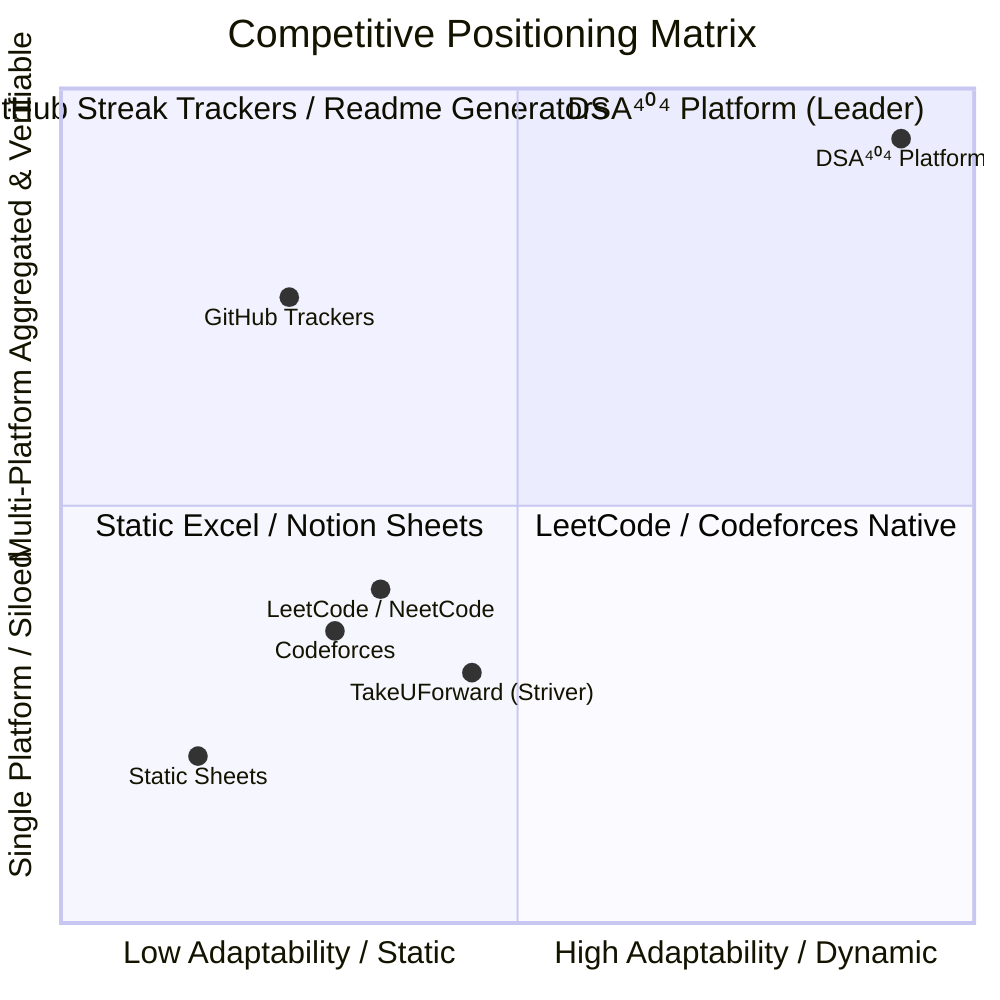
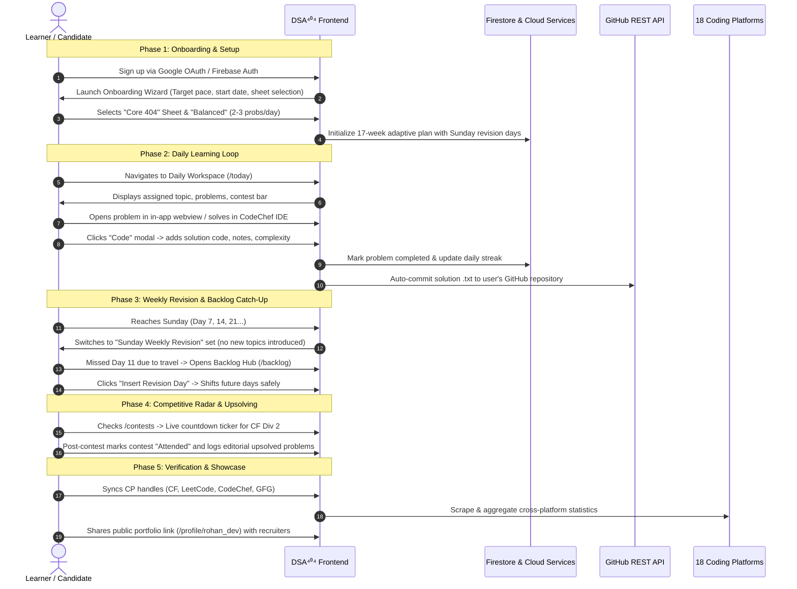
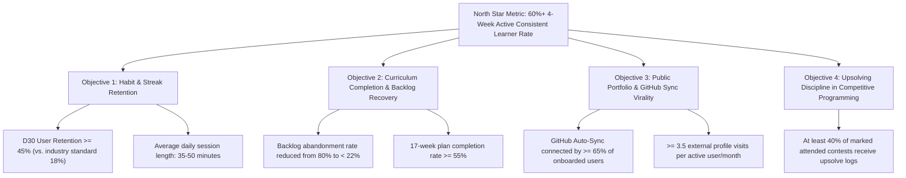
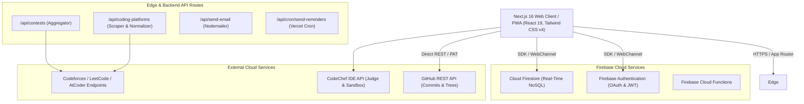
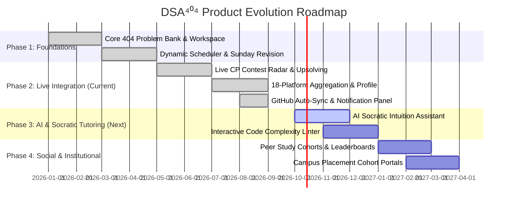

# 📑 Product Requirements Document (PRD) — DSA⁴⁰⁴ Platform

**Document Version**: 2.5  
**Product**: DSA⁴⁰⁴ Adaptive Preparation & Competitive Programming Tracking Platform  
**Owner / Product Lead**: DSA⁴⁰⁴ Product & Engineering Group  
**Status**: Approved & Baselined for Production  
**Target Release**: Release 2.5 (Current Production Baselined)  
**Classification**: Internal Product Specification & Stakeholder Blueprint  

---

## Executive Summary

**DSA⁴⁰⁴** is an adaptive, cloud-synchronized engineering preparation and competitive programming platform engineered to solve the consistency, fragmentation, and anxiety challenges inherent to technical interview preparation and algorithmic competitive programming.

Traditional preparation paths rely on static spreadsheets (e.g., Striver A2Z, NeetCode 150, Love Babbar 450) or siloed coding platforms (LeetCode, Codeforces, CodeChef, HackerRank, GeeksforGeeks). When a candidate falls behind schedule by even two days, static sheets collapse into demoralizing backlogs. Furthermore, candidates possess no single unified "Proof of Work" portfolio to demonstrate their real-world algorithmic competence to recruiters and peers.

DSA⁴⁰⁴ transforms this chaotic experience into a structured, dependency-aware **17-week mastery journey (838+ curated problems across 42 topic clusters and 6 curated sheets)** featuring:
1. **Dynamic Adaptive Scheduling**: Automatic rebalancing, "Merge Tomorrow", 1-click revision day insertion, and an interleaved Sunday Spaced Repetition cadence.
2. **Unified Multi-Platform Coder Profile**: Aggregated real-time metrics across 18 competitive coding platforms, rating trajectory charts, GitHub heatmaps, and a verified row-wise solved problems archive.
3. **Automated GitHub Solution Sync**: Direct, zero-friction commits of working solution code, intuition notes, and complexity analysis to user GitHub repositories via Personal Access Token (PAT).
4. **Live Contest Radar & Upsolving Hub**: Real-time countdowns across 5 major contest platforms with active tracking of attended, missed, and upsolved contests.
5. **Universal In-App Coding & Review**: Integrated multi-language CodeChef compiler IDE, distraction-free in-app webview modal, and spaced repetition review vaults.

---

## 1. Problem Statement & Market Opportunity

### 1.1 The Core Problems

| Problem | Root Cause | Real-World Impact on Learners |
| :--- | :--- | :--- |
| **Spreadsheet Derailment & Fatigue** | Static Excel/Notion sheets cannot adapt when life events occur or a topic takes longer than planned. | 82% of candidates abandon structured sheets within 3 weeks due to unmanageable backlogs. |
| **Platform Fragmentation** | Solved problems, contest ratings, and submission histories are scattered across 5–10 different platforms. | Candidates cannot showcase a cohesive portfolio; recruiters cannot quickly verify authentic algorithmic problem-solving. |
| **The "Blind Upsolving" Gap** | Contests are attended or missed, but editorial problems are rarely systematically solved afterwards. | Skill stagnation; candidates repeatedly fail identical problem archetypes in live technical assessments. |
| **Retention Decay & Lack of Revision** | Linear problem solving without deliberate spaced repetition leads to forgetting patterns learned 4 weeks prior. | Severe anxiety before interviews ("I solved 300 problems but forgot how to do DP on trees"). |
| **Manual Portfolio Burden** | Exporting code and pushing solutions to GitHub requires tedious manual copy-pasting. | Public repositories remain empty or outdated, reducing hiring visibility. |

### 1.2 Market Opportunity & Positioning



---

## 2. Product Vision & Value Proposition

### 2.1 Vision Statement
> *"To turn algorithmic interview preparation from a stressful, fragmented chore into an adaptive, verifiable, and empowering daily engineering habit."*

### 2.2 Core Value Propositions

1. **For Learners & Job Seekers**:
   - Never feel lost or crushed by backlogs: intelligent auto-healing shifts your schedule realistically.
   - Master algorithmic intuition through structured topic clusters rather than memorization.
   - Automatically build a verified, green-commit GitHub repository while practicing.
2. **For Competitive Programmers**:
   - Synchronize contest schedules across LeetCode, Codeforces, CodeChef, AtCoder, and HackerRank in a single live radar.
   - Close the loop with dedicated contest upsolving workflows.
3. **For Hiring Managers & Recruiters**:
   - Access a clean, authenticated public portfolio (`/profile/[username]`) with interactive rating trajectory graphs, verified solution code, and algorithmic breadth breakdowns.

---

## 3. Target User Personas & User Journeys

### 3.1 User Personas

#### Persona 1: Rohan — The College Pre-Final Year Student
- **Profile**: 3rd-year Computer Science student preparing for upcoming on-campus internships and FAANG tier-1 placements.
- **Pain Point**: Overwhelmed by conflicting roadmaps (Striver vs. NeetCode vs. Love Babbar); constantly falls behind schedule during semester exams.
- **Goals**: Follow a proven, disciplined daily roadmap; maintain a steady GitHub commit streak; guarantee complete syllabus coverage before interviews.
- **Key DSA⁴⁰⁴ Feature**: Curated Sheet Switcher (Striver A2Z / Core 404), Adaptive Plan Pausing during exams, Automated GitHub Solution Commits.

#### Persona 2: Priya — The Working Professional SDE-1
- **Profile**: Software engineer with 2 years of experience aiming for an SDE-2 career jump.
- **Pain Point**: Limited daily time budget (1–1.5 hours in the evening). Unpredictable overtime causes missed days.
- **Goals**: Consistent 2 problems/day pace; automated Sunday revision; fast catch-up when work deadlines strike.
- **Key DSA⁴⁰⁴ Feature**: Tutor Pace Presets (Casual / Balanced), "Merge Tomorrow", Backlog Catch-Up Hub with 1-click revision day insertion.

#### Persona 3: Alex — The Competitive Programming Aspirant
- **Profile**: Enthusiast aiming for Codeforces Candidate Master (1900+) and CodeChef 5-Star.
- **Pain Point**: Misses contest start times; forgets to upsolve hard problems; has profile stats scattered across 6 distinct websites.
- **Goals**: Unified contest radar countdowns; upsolve checklist; single unified profile displaying ratings and badges.
- **Key DSA⁴⁰⁴ Feature**: Live CP Contest Radar (`/contests`), Attended/Upsolved status engine, 18-Platform Aggregated Profile (`/profile`).

#### Persona 4: Vikram — The Technical Recruiter / Hiring Lead
- **Profile**: Engineering manager screening candidate portfolios for strong engineering fundamentals.
- **Pain Point**: Resumes claim "500+ LeetCode solved" without verifiable proof, git commits, or clean code intuition.
- **Goals**: Inspect verified problem-solving breadth, clean GitHub commits, and consistent preparation history.
- **Key DSA⁴⁰⁴ Feature**: Public Portfolio Showcase (`/profile/[username]`), Row-Wise Solved Archive, GitHub Commit verification.

---

### 3.2 End-to-End User Journey Map



---

## 4. Product Objectives, OKRs & Success Metrics

### 4.1 North Star Metric
> **Active Consistent Learner Rate (ACLR)**: Percentage of active users who complete at least 5 study days per week over any rolling 4-week window.

### 4.2 Objective Key Results (OKRs)



---

## 5. Information Architecture & Navigation Hierarchy

### 5.1 Route Map & Screen Breakdown

```
DSA⁴⁰⁴ Platform
├── Public Routes
│   ├── /auth                       # Authentication (Email/Password, Google OAuth)
│   ├── /reset-password             # Password recovery
│   └── /profile/[uid]              # Public, shareable verified developer portfolio
│
├── Core Learning Subsystems
│   ├── /today                      # Daily Learning Workspace & active problem list
│   ├── /problems                   # Master 838+ Problem Bank across 6 Curated Sheets + XLSX Export
│   ├── /topics                     # 42 Topic Clusters, visual completion rings & skipped topic solver
│   ├── /weeks                      # 17-Week Structured Roadmap with Sunday revision markers
│   ├── /day/[dayNumber]            # Day Deep-Dive View (status, custom notes, day rebalancer)
│   └── /editor                     # Multi-language in-app code editor with CodeChef compiler
│
├── Review & Remediation Subsystems
│   ├── /review                     # Bookmarked Spaced Repetition Review Vault
│   └── /backlog                    # Backlog Catch-Up Hub with 1-click schedule sliding
│
├── Performance & Social Subsystems
│   ├── /progress                   # Streak tracking, difficulty distributions, achievement badges
│   ├── /contests                   # Live contest countdown radar across 5 CP platforms & upsolving
│   ├── /profile                    # Personal coder profile with 18-platform stats sync & GitHub heatmap
│   └── /messages                   # Announcements and community broadcast channel
│
└── Configuration & Customization
    └── /settings                   # Adaptive planner, tutor presets, start date, GitHub sync, theme studio
```

### 5.2 Navigation Layout & Core UI Surfaces

1. **Collapsible Sidebar (Desktop)**:
   - Expandable (`w-[280px]`) and compact icon rail (`w-[68px]`).
   - Grouped sections: *Learning Core*, *Analytics & Contests*, *Tools & Settings*.
2. **Top Navigation Ribbon**:
   - Dynamic page breadcrumb and contextual subtitle.
   - Global Command Palette trigger button (`Ctrl+K`).
   - Live Contests Platform status ribbon.
   - Quick CodeChef IDE launcher.
   - Notification Bell button with real-time unread badge counter.
   - Profile avatar with quick dropdown menu.
3. **Right-Side Notification Panel Drawer (`NotificationPanel.tsx`)**:
   - Slide-over drawer overlay accessible globally.
   - Categorized notification tabs: *All*, *Plan*, *Contests*, *Streak*, *Review*, *System*.
   - In-app actions: "Mark all as read", "Clear all", dismiss individual items.
4. **Mobile Bottom Navigation Bar & Native Drawer**:
   - Quick-access tabs: *Today*, *Problems*, *Roadmap*, *Contests*, *Profile*.
   - Responsive touch gestures, safe area insets for iOS/Android home indicator.

---

## 6. Detailed Feature Specifications & Functional Requirements

### 6.1 Subsystem 1: Daily Learning Workspace (`/today`)

#### 6.1.1 Overview & Purpose
The primary launchpad for the learner's day. Provides clarity on today's assigned topic, problem goals, estimated duration, and quick-action tools.

#### 6.1.2 Functional Capabilities
- **Active Day Resolution**: Automatically displays the day corresponding to `startDate + elapsed days` (adjusted for pauses and injected revision days).
- **Topic Context**: Renders topic badge, difficulty level (Easy, Medium, Hard), and estimated time commitment.
- **Top Contest Bar (`ContestsPlatformBar`)**: Compact indicators displaying active/upcoming contests across LeetCode, Codeforces, CodeChef, AtCoder, HackerRank.
- **Problem Status Engine**: One-click toggling of problem completion with immediate visual feedback (strike-through, progress bar increment, audio chime).
- **Auto-Saving Day Notes**: Markdown/rich-text scratchpad debounced to auto-save directly to Firestore without requiring manual submit buttons.
- **"Merge Tomorrow" Action**: Allows ahead-of-schedule learners to pull tomorrow's problems into today's queue; gracefully shifts remaining schedule days without creating gaps.
- **Solution & Notes Modal (`CodeModal`)**:
  - Modal to input user solution code in any major programming language (C++, Java, Python, JS/TS).
  - Approach summary and intuition text box.
  - Time Complexity (e.g., $O(N \log N)$) and Space Complexity (e.g., $O(1)$) metadata tags.
  - "Save & Sync to GitHub" button.

---

### 6.2 Subsystem 2: Master Problem Bank & 6 Curated Sheets (`/problems`)

#### 6.2.1 Overview & Purpose
A comprehensive, searchable repository of 838+ problems categorized across 6 industry-standard curriculum sheets.

#### 6.2.2 The 6 Curated Sheets
1. **Core 404 Sheet**: The foundational 404-problem master blueprint grouped by pattern.
2. **Striver A2Z DSA Sheet**: Industry standard comprehensive sheet (step-by-step from basics to advanced graphs/DP).
3. **NeetCode 150**: High-yield blind-style curation targeting FAANG patterns.
4. **Love Babbar 450**: High-reputation Indian product company placement sheet.
5. **Fraz 450 Sheet**: Curated high-frequency competitive interview questions.
6. **Blind 75**: Essential high-yield interview problems for time-constrained candidates.

#### 6.2.3 Functional Capabilities
- **Real-Time Client-Side Filtering**: Instant sub-50ms filtering by difficulty (Easy, Medium, Hard), platform tag, topic cluster, and solved status.
- **Curriculum Re-Seeding**: Selecting a sheet reconfigures the user's active 17-week plan while preserving existing completion records for identical problem IDs.
- **Direct Excel Export (`.xlsx`)**: One-click export downloading the active sheet with problem names, URLs, patterns, difficulty, and completion marks.

---

### 6.3 Subsystem 3: Topic Explorer & Skipped Topic Solver (`/topics`)

#### 6.3.1 Overview & Purpose
Provides a macroscopic view of all 42 DSA topic clusters with progress metrics and on-demand remediation.

#### 6.3.2 Functional Capabilities
- **Circular Completion Rings**: Real-time percentage indicator per topic.
- **Topic Cards**: Displays total problems, solved count, difficulty breakdown, and prerequisite topic tags.
- **Skipped Topic Solve Modal (`SkippedTopicSolveModal`)**: Allows users to open and complete problems from previously skipped or future topics without modifying their active daily sequence.

---

### 6.4 Subsystem 4: 17-Week Curriculum Roadmap & Sunday Revision Rhythm (`/weeks`)

#### 6.4.1 Overview & Purpose
A timeline visualizer displaying the complete 17-week progression from basics to advanced algorithmic paradigms.

#### 6.4.2 The Sunday Revision Architecture
- **Automatic Interleaving**: Every 7th day (Days 7, 14, 21, 28, ... 119) is designated as a **Sunday Weekly Revision & Catch-Up Day**.
- **Pause New Topics**: No new algorithmic concepts are introduced on revision days.
- **Revision Set Aggregation**: Pulls high-yield problems from the preceding 6 days and previously flagged review problems.
- **Burnout Mitigation**: Provides a planned buffer day to prevent schedule slippage.

---

### 6.5 Subsystem 5: Progress Analytics & Gamification (`/progress`)

#### 6.5.1 Overview & Purpose
Visualizes quantitative progress, builds habit reinforcement, and celebrates prep milestones.

#### 6.5.2 Functional Capabilities
- **Daily Streak Engine**: Tracks current continuous streak, longest streak, and last active timestamp.
- **Difficulty Breakdown Chart**: Radial/donut charts displaying Easy, Medium, and Hard distributions against recommended target ratios (40% Easy, 45% Medium, 15% Hard).
- **Weekly Completion History**: Recharts bar graph displaying daily problems solved over the past 14 days.
- **Achievement Badges Engine (`BadgesGrid`)**:
  - *First Blood*: First problem solved.
  - *7-Day Warrior*: 7-day uninterrupted streak.
  - *Century Club*: 100 problems solved.
  - *Pattern Master*: All pattern archetypes solved in a single topic.
  - *Contest Gladiator*: 5 CP contests attended and logged.

---

### 6.6 Subsystem 6: Review Vault & Spaced Repetition (`/review`)

#### 6.6.1 Overview & Purpose
A dedicated staging area for complex problems requiring deliberate multi-pass review to prevent forgetting.

#### 6.6.2 Functional Capabilities
- **One-Click Bookmark**: Toggle `forReview: true` from any problem card or modal.
- **Spaced Repetition Schedule**: Categorizes problems into intervals: *3 Days*, *7 Days*, *14 Days*, *30 Days*.
- **Review Vault Filter**: Filter by review urgency, tag, or topic.

---

### 6.7 Subsystem 7: Backlog Catch-Up Hub (`/backlog`)

#### 6.7.1 Overview & Purpose
Eliminates preparation anxiety by surfacing missed days and providing automated 1-click schedule realignment.

#### 6.7.2 Functional Capabilities
- **Past Day Incompleteness Scan**: Automatically detects calendar days prior to today with unsolved problems.
- **1-Click "Insert Revision Day"**: Slides all future planned days forward by 1 calendar day, turning today into a dedicated catch-up day without guilt.
- **Auto-Healing Routine**: Detects and repairs broken date sequences or duplicate day numbers upon app boot.

---

### 6.8 Subsystem 8: Live CP Contest Radar & Upsolving (`/contests`)

#### 6.8.1 Overview & Purpose
A centralized competitive programming command center connecting candidates to the global contest ecosystem.

#### 6.8.2 Supported Contest Platforms
- **LeetCode**: Weekly & Biweekly Contests.
- **Codeforces**: Div 1, Div 2, Div 3, Div 4 rounds.
- **CodeChef**: Starters and Cook-Off rounds.
- **AtCoder**: Beginner (ABC) and Regular (ARC) Contests.
- **HackerRank**: University and open challenge series.

#### 6.8.3 Functional Capabilities
- **Live Real-Time Countdown**: Countdown ticker (`XXd XXh XXm XXs`) updating every second.
- **Contest Status Engine**: Mark contests as *Registered*, *Attended*, *Missed*, or *Upsolved*.
- **Direct Platform Links**: 1-click launch to the official contest arena.
- **Contest History Log**: Archives past contest performances and tracks editorial upsolving notes.

---

### 6.9 Subsystem 9: Unified 18-Platform Coder Profile (`/profile` & `/profile/[uid]`)

#### 6.9.1 Overview & Purpose
A verifiable public portfolio aggregating stats, ratings, and commit activity across all major coding platforms.

#### 6.9.2 The 18 Supported Platforms
1. LeetCode
2. Codeforces
3. CodeChef
4. GeeksforGeeks (GFG)
5. AtCoder
6. HackerRank
7. HackerEarth
8. GitHub
9. TopCoder
10. SPOJ
11. CSES
12. InterviewBit
13. LintCode
14. Kaggle
15. Codewars
16. Project Euler
17. Beecrowd
18. VJudge

#### 6.9.3 Functional Capabilities
- **Claim Unique Username**: Users claim unique `@username` identifiers for their public vanity URL (`/profile/[username]`).
- **Interactive Rating Trajectory Graphs (`ContestHistoryChart.tsx`)**: Recharts time-series graph tracking rating points across Codeforces, CodeChef, and LeetCode.
- **Live GitHub Contribution Heatmap (`GitHubContributionHeatmap.tsx`)**: Visual SVG grid rendering user commit density over the past 365 days.
- **Row-Wise Solved Problems Archive (`SolvedProblemsArchive.tsx`)**: Searchable, filterable table displaying every solved problem, completion date, platform badge, and link to code.
- **Profile Customization**: Custom avatar and banner uploads (base64 cloud sync), bio, target dream company, and social links (LinkedIn, X, Portfolio).

---

### 6.10 Subsystem 10: In-App Code Editor & Scratchpad (`/editor`)

#### 6.10.1 Overview & Purpose
Distraction-free integrated coding environment with real-time compilation capabilities.

#### 6.10.2 Functional Capabilities
- **Multi-Language Support**: Syntax highlighting and template boilerplate for C++20, Java 17, Python 3.11, JavaScript/TypeScript.
- **CodeChef Compiler Integration**: Execute arbitrary source code with custom `stdin` input; returns execution time, memory usage, stdout, and stderr.
- **Save to Scratchpad**: Stores user drafts locally and across cloud sessions.

---

### 6.11 Subsystem 11: Automated GitHub Solution Sync

#### 6.11.1 Overview & Purpose
Automatically turns daily problem solving into green GitHub contribution squares and an organized portfolio repository.

#### 6.11.2 Functional Capabilities
- **PAT Authentication**: Connects using a GitHub Personal Access Token (classic or fine-grained) with `repo` scope.
- **Configurable Repository & Branch**: Specify target repo (e.g., `username/DSA-Solutions`) and branch (e.g., `main`).
- **Automated Commit Structure**:
  - Path format: `topics/{topic-name}/{problem-name}.txt` or `.{cpp|py|java}`.
  - File header: Problem title, original problem URL, difficulty, time complexity, space complexity.
  - File body: Intuition notes followed by solution source code.
  - Commit message: `feat(solve): [Topic] Problem Name (O(N) time, O(1) space) via DSA⁴⁰⁴`.

---

### 6.12 Subsystem 12: Notification Engine & Right-Side Notification Panel

#### 6.12.1 Overview & Purpose
Keeps users accountable with contextual notifications, reminders, and alerts without being intrusive.

#### 6.12.2 Functional Capabilities
- **Header Bell Button & Unread Counter**: Located in top-right header area; displays animated badge count for unread alerts.
- **Right-Side Slide-Over Drawer (`NotificationPanel.tsx`)**: Smooth sliding sheet listing categorized notifications.
- **Notification Types**:
  - *Plan Notifications*: Daily homework reminders, Sunday revision alerts, backlog warnings.
  - *Contest Notifications*: 24h and 1h alerts before registered contests.
  - *Streak Notifications*: Daily streak at risk alert (sent at 8:00 PM if no problem solved).
  - *Review Notifications*: Spaced repetition review triggers (Day 3, Day 7, Day 14).
  - *System Broadcasts*: Platform updates, new sheet releases, and announcements.
- **Management Controls**: "Mark all as read", individual dismiss button, and "Clear all".

---

### 6.13 Subsystem 13: Global Command Palette (`Ctrl+K` / `Cmd+K`)

#### 6.13.1 Overview & Purpose
Instant power-user keyboard navigation and indexing across the entire platform.

#### 6.13.2 Functional Capabilities
- Keyboard shortcut `Ctrl+K` (Windows/Linux) or `Cmd+K` (macOS).
- Instant search indexing all 838+ problems, 42 topics, 17 weeks, and system settings pages.
- Action shortcuts: Jump to `/today`, toggle theme, open Code Editor, open Backlog Hub.

---

### 6.14 Subsystem 14: Theme Studio & Visual Customizer

#### 6.14.1 Overview & Purpose
Allows learners to tailor their visual environment to minimize eye fatigue during late-night study sessions.

#### 6.14.2 Functional Capabilities
- **Perceptual OKLCH Color Space**: Fine-grained controls for primary accent hue, background darkness, card surface opacity, and border radiance.
- **Curated Theme Presets**: Cyberpunk Neon, Obsidian Dark, Nord Aurora, Emerald Matrix, Deep Space Slate.
- **Dynamic Google Fonts Typography**: Choose between modern sans-serifs (Inter, Roboto, Outfit, Poppins) and monospaced code fonts (JetBrains Mono, Fira Code).

---

### 6.15 Subsystem 15: Progressive Web App (PWA) & Offline Capabilities

#### 6.15.1 Overview & Purpose
Enables standalone desktop and mobile home screen installation with fast cached launches.

#### 6.15.2 Functional Capabilities
- Valid Web App Manifest (`manifest.json`) with responsive icons, theme colors, and display `standalone`.
- Service worker caching core static assets, fonts, and problem catalog.
- Offline graceful fallback displaying cached problem sets and local drafts.

---

## 7. Technical Architecture & Data Model

### 7.1 System Component Diagram



### 7.2 Core Firestore Data Schemas

#### 1. User Profile Document (`users/{userId}`)
```typescript
interface UserProfile {
  uid: string;
  email: string;
  displayName: string;
  username: string; // Unique public handle
  photoURL?: string;
  bannerURL?: string;
  bio?: string;
  targetCompany?: string;
  createdAt: number;
  streak: {
    current: number;
    longest: number;
    lastActiveDate: string; // YYYY-MM-DD
  };
  handles: {
    leetcode?: string;
    codeforces?: string;
    codechef?: string;
    geeksforgeeks?: string;
    github?: string;
    atcoder?: string;
    hackerrank?: string;
  };
  githubSync: {
    enabled: boolean;
    repoName: string;
    branch: string;
    patTokenMasked?: string;
  };
}
```

#### 2. User Plan Configuration (`plans/{userId}`)
```typescript
interface UserPlan {
  userId: string;
  sheetId: "core404" | "striverA2Z" | "neetcode150" | "love450" | "fraz450" | "blind75";
  startDate: string; // YYYY-MM-DD
  targetPerDay: number; // 1 to 6
  pacePreset: "casual" | "balanced" | "standard" | "intensive";
  isPaused: boolean;
  pausedAt?: string;
  injectedRevisionDays: number;
  totalDays: number; // Default 119 (17 weeks)
  completedProblemsCount: number;
  updatedAt: number;
}
```

#### 3. Problem Progress Document (`progress/{userId}/problems/{problemId}`)
```typescript
interface ProblemProgress {
  problemId: string;
  sheetId: string;
  dayNumber: number;
  isCompleted: boolean;
  completedAt?: number;
  forReview: boolean;
  reviewIntervalDays?: number;
  userNotes?: string;
  solutionCode?: string;
  language?: string;
  timeComplexity?: string;
  spaceComplexity?: string;
  githubCommitSha?: string;
}
```

---

## 8. Non-Functional Requirements (NFRs)

### 8.1 Performance & Latency Standards
- **NFR-P1 (First Contentful Paint)**: FCP $\le 1.2\text{s}$ under 4G network conditions.
- **NFR-P2 (Search Memoization)**: Problem catalog filtering across 838+ records must execute in $\le 50\text{ms}$ client-side.
- **NFR-P3 (Debounced Auto-Save)**: Day notes auto-save triggered after 1200ms debounce to prevent database write throttling.

### 8.2 Security, Privacy & Token Safety
- **NFR-S1 (Zero PAT Server Exposure)**: User GitHub Personal Access Tokens are stored client-side in encrypted local storage and sent directly to `api.github.com`, never logged or stored in shared Firestore collections.
- **NFR-S2 (Firestore Owner Isolation)**: Strict rule enforcement (`request.auth.uid == resource.data.userId` or `request.auth.uid == userId`) prevents unauthorized cross-user modifications.
- **NFR-S3 (Pointer Event Safety)**: Custom `safePointerCapture` wrapper catches DOM exceptions (`NotFoundError` / `InvalidPointerId`) in Radix UI modal closures.

### 8.3 Reliability, Scalability & Availability
- **NFR-R1 (Platform Availability)**: 99.9% uptime target via edge-hosted Next.js on Vercel CDN and Firebase Cloud Infrastructure.
- **NFR-R2 (Schedule Self-Healing)**: Built-in calendar resolver automatically repairs schedule date gaps without loss of progress.

---

## 9. Product Roadmap & Phasing Strategy



### 9.1 Phase Details

#### Phase 1: Core Preparation Architecture (Completed & Baselined)
- 838+ curated problem catalog across 6 sheets.
- 17-week structured roadmap with interleaved Sunday revisions.
- Daily learning workspace with debounced notes and code modals.
- Backlog recovery hub and pace preset management.

#### Phase 2: Multi-Platform Coder Hub & Public Proof (Current Production)
- Real-time contest countdown radar for LeetCode, Codeforces, CodeChef, AtCoder, HackerRank.
- Unified public portfolio with ratings graphs, GitHub heatmap, and solved archive.
- Automated solution sync to user GitHub repositories via PAT.
- Right-side slide-over notification drawer (`NotificationPanel.tsx`) with categorized tabs.
- Multi-language in-app code editor with CodeChef compiler execution.

#### Phase 3: Socratic AI & Intelligent Interview Simulator (Q4 2026)
- **Socratic AI Tutor**: An embedded AI assistant that provides hints and conceptual questions rather than giving away code answers.
- **Automated Space/Time Complexity Verifier**: AST-based analysis calculating theoretical asymptotic complexity of user-submitted code.
- **Target Company Simulation Packs**: Auto-curated 14-day mock sprints for Google, Meta, Amazon, Microsoft, and Uber.

#### Phase 4: Social Cohorts & Enterprise Campus Suite (Q1 2027)
- **Peer Study Cohorts**: Private 5-to-10 member study squads with shared streak boards and weekly group contests.
- **University Campus Placement Dashboard**: Enables university placement cells to monitor batch-wide preparation metrics in real-time.

---

## 10. Risks, Assumptions & Mitigation Strategies

| Risk Category | Identified Risk | Impact | Probability | Mitigation Strategy |
| :--- | :--- | :--- | :--- | :--- |
| **External API Throttling** | Scraping 18 platform stats could trigger rate limits or CAPTCHAs. | High | Medium | Implement aggressive server-side caching (6-hour TTL per handle), polite user-agent rotation, and fallback to cached state. |
| **GitHub Token Security** | Users sensitive to providing Personal Access Tokens. | Critical | Low | Provide fine-grained permission documentation (only `repo:contents` needed); keep tokens strictly in client browser local storage. |
| **User Burnout Slippage** | Learners getting overwhelmed after falling 5+ days behind. | High | High | Implement pro-active "Burnout Shield" prompts offering 1-click schedule sliding and Sunday catch-up allocation. |
| **Compiler Downtime** | CodeChef IDE API experiencing transient server errors. | Medium | Medium | Graceful fallback with clear UI status messaging and link to solve directly on the native platform. |

---

## 11. Launch & Production Verification Checklist

- [x] **Zero TypeScript Errors**: Verified clean build via `npx tsc --noEmit`.
- [x] **Production Bundle Build**: Verified clean Turbopack build via `next build` (0 fatal errors across all 24 routes).
- [x] **Responsive Mobile Experience**: Verified layout adaptations for iPhone, iPad, and desktop viewports.
- [x] **Firestore Security Rules**: Strict read/write isolation enforced in `firestore.rules`.
- [x] **PWA Manifest Validation**: Manifest and service worker registered without console warnings.
- [x] **Right-Side Notification Panel**: Live bell badge, smooth slide-over drawer, categorized alerts, and unread clear/dismiss actions.
- [x] **GitHub Auto-Sync Flow**: Formatted solution commits with complexity metadata and commit tags.
- [x] **Curated Sheets & Excel Export**: Valid `.xlsx` downloads verified across all 6 problem sheets.

---

> **Document Approval**: DSA⁴⁰⁴ Product Architecture & Engineering Group  
> **Status**: Baselined, Production-Ready, and Active
