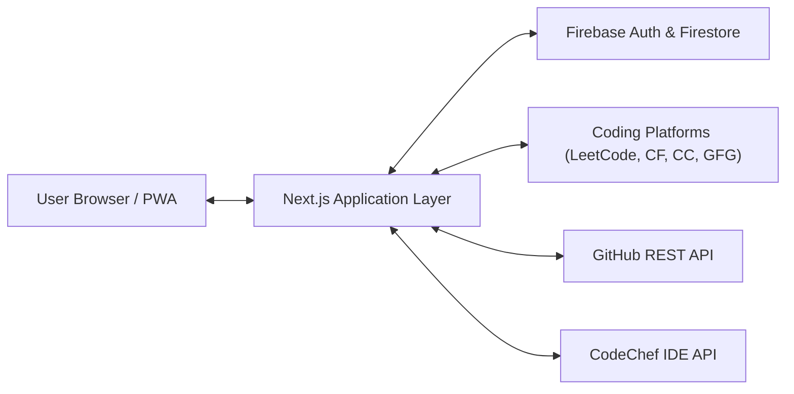

# 📋 Software Requirements Specification (SRS) — DSA404 Platform

**Document Version**: 2.0  
**Status**: Approved & Baselined  
**Standard**: IEEE Std 830-1998 Compliant  
**Project**: DSA⁴⁰⁴ Adaptive Preparation & Competitive Programming Tracking Platform  

---

## 1. Introduction

### 1.1 Purpose
This Software Requirements Specification (SRS) document provides a complete, formal description of the functional, non-functional, interface, and behavioral requirements for the **DSA404 Platform**. It is intended for software engineers, product architects, testers, and academic reviewers.

### 1.2 Document Conventions
- **`FR-[NUM]`**: Functional Requirement identifier.
- **`NFR-[NUM]`**: Non-Functional Requirement identifier.
- **`MUST` / `SHALL`**: Mandatory requirement.
- **`SHOULD`**: Highly recommended practice.
- **`MAY`**: Optional or extensible feature.

### 1.3 Intended Audience
- **Core Developers**: Implementing and maintaining frontend, API adapters, and database rules.
- **System Testers**: Formulating end-to-end integration and automated regression test plans.
- **End-Users (Software Engineering Students & Candidates)**: Reference for system capabilities.

### 1.4 Project Scope
DSA404 is a web-based, mobile-installable (PWA) adaptive engineering platform that transforms unstructured algorithmic problem sets into a structured 17-week preparation journey. Key capabilities include:
- Curriculum sequencing across 42 topic clusters (838+ curated problems).
- Dynamic schedule rebalancing, pace configuration, and automatic Sunday revision interleaving.
- Unified coding profile aggregation across 18 competitive programming platforms.
- Automated GitHub repository solution code and intuition note commits.
- Real-time contest countdown radar across 5 major contest platforms.
- Right-side slide-over notification drawer with categorized push alerts.

---

## 2. Overall Description

### 2.1 Product Perspective
DSA404 operates as an independent, cloud-synchronized single-page application built on Next.js 16 (App Router), leveraging Firebase Authentication and Firestore Cloud Database. It integrates with external third-party REST and GraphQL APIs for coding statistics, code compilation, and Git version control synchronization.

### 2.2 Product Functions (Subsystem Summary)
1. **Daily Workspace (`/today`)**: Daily topics, problem lists, day notes, solution modal, and live contest platform bar.
2. **Problem Bank & Sheets (`/problems`)**: 838+ problems across 6 curated sheets with Excel (.xlsx) export.
3. **Topic Explorer (`/topics`)**: 42 topic clusters with completion rings and on-demand skipped topic solve modal.
4. **Roadmap & Sunday Revision (`/weeks`)**: 17-week curriculum timeline with mandatory Sunday revision rhythm.
5. **Progress & Gamification (`/progress`)**: Daily streak engine, difficulty distributions, and achievement badges.
6. **Review Vault (`/review`)**: Bookmarked problems with spaced repetition scheduling.
7. **Backlog Catch-Up Hub (`/backlog`)**: Identification of incomplete days with 1-click revision day insertion.
8. **Day Deep-Dive (`/day/[dayNumber]`)**: Day-level problem status, notes, and individual day rebalancing.
9. **Contest Radar (`/contests`)**: Live, upcoming, and missed CP contest schedules with live countdowns and upsolving tracking.
10. **Unified Coder Profile (`/profile`)**: Public handles, rating trajectory graphs, GitHub heatmap, and row-wise solved archive.
11. **In-App Code Editor (`/editor`)**: Syntax-highlighted editor with CodeChef compiler integration.
12. **Community Broadcast (`/messages`)**: System announcements and notifications.
13. **Adaptive Planner & Settings (`/settings`)**: Tutor pace presets, plan start date, pause/resume, and reminders.
14. **GitHub Auto-Sync**: Personal Access Token (PAT) integration for automatic commit of solutions to GitHub.
15. **Theme Studio**: Perceptual OKLCH color fine-tuning and Google Fonts typography studio.
16. **In-App Webview Overlay**: Sandboxed browser overlay for distraction-free problem reading.
17. **PWA Native Experience**: Install banners, offline caching, and standalone windowing.
18. **Notification Engine (`NotificationPanel.tsx`)**: Header bell button with live badge counter and right-side sliding panel.
19. **Global Command Palette (`Ctrl+K`)**: Rapid indexed search across problems, topics, and settings.
20. **Security & Pointer Safety**: Firestore owner isolation rules and safe pointer capture handling.

### 2.3 User Classes and Characteristics
- **Student / Candidate**: Primary user solving problems daily, tracking streaks, inspecting rating trajectories, and committing solutions to GitHub.
- **Public Viewer / Recruiter**: Unauthenticated external visitor inspecting a candidate's verified portfolio via `/profile/[username]`.

### 2.4 Operating Environment
- **Browser Compatibility**: Chromium 110+, Safari 16+, Firefox 115+, Edge 110+.
- **Device Support**: Mobile (iOS & Android via PWA / Mobile Safari / Chrome), Tablet, Desktop (macOS, Windows, Linux).
- **Backend / Edge Runtime**: Node.js 20+ / Vercel Edge / Firebase Functions.

---

## 3. External Interface Requirements

### 3.1 User Interfaces
- **Design System**: Glassmorphism aesthetic, card surfaces with subtle borders (`border-white/10` / `border-border`), and OKLCH color tokens.
- **Responsive Layout**: Resizable desktop sidebar (`w-[64px]` to `w-[320px]`), collapsible mobile drawer, and bottom navigation bar.
- **Top Controls**: Header ribbon featuring active page hint, global command palette trigger, live contest IDE trigger, notification bell with animated unread badge counter, and user profile menu.

### 3.2 Hardware Interfaces
- Standard pointer, mouse, touch, and physical keyboard interfaces.

### 3.3 Software Interfaces
| Service | Protocol | Function |
| :--- | :--- | :--- |
| **Firebase Auth** | HTTPS / JWT | User registration, password resets, Google OAuth |
| **Firebase Firestore** | WebChannel / gRPC | Real-time cloud persistence of user plans, settings, notes |
| **GitHub REST API** | HTTPS / Bearer Token | Automated file creation and Git commit pushes |
| **CodeChef IDE API** | HTTPS / JSON | Code compilation, stdin input execution, stdout diagnostics |
| **FCM & Web Push API** | Service Worker | Browser push notifications when tabs are inactive |

---

## 4. System Features & Functional Requirements

### FR-01: Daily Learning Workspace
- **FR-01.1**: The system **SHALL** display today's assigned topic, level, problem goals, and estimated completion time based on active plan dates.
- **FR-01.2**: The system **SHALL** render the `ContestsPlatformBar` at the top of the workspace showing live contest platform indicators.
- **FR-01.3**: The system **SHALL** provide a rich text / markdown "Day Notes" area that auto-saves to Firestore upon text change debounce.
- **FR-01.4**: The system **SHALL** support "Merge Tomorrow", appending tomorrow's problems to today and advancing future day numbers without breaking sequence.
- **FR-01.5**: The system **SHALL** open `CodeModal` when clicking "Code", allowing users to save solution code, key notes, time complexity, and space complexity.

### FR-02: Master Problem Bank & Curated Sheet Selector
- **FR-02.1**: The system **SHALL** provide a searchable catalog of 838+ curated DSA problems.
- **FR-02.2**: The system **SHALL** allow switching between 6 sheets: Core 404, Striver A2Z, NeetCode 150, Love Babbar 450, Fraz 450, Blind 75.
- **FR-02.3**: Switching a sheet **SHALL** re-seed the user's daily curriculum sequence starting from their configured start date.
- **FR-02.4**: The system **SHALL** provide direct Excel (.xlsx) download links for all 6 curated sheets.
- **FR-02.5**: The system **SHALL** allow filtering by difficulty (Easy, Medium, Hard), platform, and completion status.

### FR-03: Topic Explorer & Skipped Topic Solver
- **FR-03.1**: The system **SHALL** display all 42 DSA topic clusters with progress percentage indicators.
- **FR-03.2**: The system **SHALL** allow on-demand solving of skipped or postponed topics via `SkippedTopicSolveModal` without altering the main schedule sequence.

### FR-04: 17-Week Curriculum Roadmap & Sunday Revision Rhythm
- **FR-04.1**: The system **SHALL** lay out a 17-week chronological roadmap with week-by-week cards.
- **FR-04.2**: The system **SHALL** designate every 7th day (Sundays) as a **Sunday Weekly Revision & Catch-Up Day**.
- **FR-04.3**: Sunday revision days **SHALL** pause new topic introductions and aggregate a spaced repetition revision set.

### FR-05: Progress Analytics, Gamification & Badges
- **FR-05.1**: The system **SHALL** track current streak, longest streak, and last active timestamp.
- **FR-05.2**: The system **SHALL** calculate achievement badges (e.g. *7-Day Streak*, *30-Day Streak*, *100 Solved*) and display them in `BadgesGrid`.
- **FR-05.3**: The system **SHALL** render weekly completion bar charts and difficulty distribution breakdowns.

### FR-06: Review Vault & Spaced Repetition
- **FR-06.1**: The system **SHALL** maintain a `/review` list of all problems flagged with `forReview: true`.
- **FR-06.2**: The system **SHALL** allow users to set spaced repetition reminder alerts (3, 7, 14, 30 days).

### FR-07: Backlog Catch-Up Hub
- **FR-07.1**: The system **SHALL** scan active plan history and list all past calendar days with incomplete problems.
- **FR-07.2**: The system **SHALL** allow inserting an emergency revision day, sliding future days forward by 1 day.

### FR-08: Single Day Deep-Dive View
- **FR-08.1**: The system **SHALL** render `/day/[dayNumber]` displaying the complete status and problems for any selected roadmap day.

### FR-09: Live CP Contest Radar & Upsolving
- **FR-09.1**: The system **SHALL** fetch live and upcoming contests from LeetCode, Codeforces, CodeChef, AtCoder, and HackerRank via `/api/contests`.
- **FR-09.2**: The system **SHALL** provide a live countdown ticker (`XXd XXh XXm XXs`) updating every second.
- **FR-09.3**: The system **SHALL** allow users to mark contest attendance as *Attended*, *Missed*, or *Upsolved*.

### FR-10: Unified Coder Profile & Public Portfolio
- **FR-10.1**: The system **SHALL** allow users to claim unique `@username` identifiers and generate a public shareable portfolio at `/profile/[username]`.
- **FR-10.2**: The system **SHALL** support custom avatar and banner image uploads encoded as base64 with cloud sync.
- **FR-10.3**: The system **SHALL** scrape and normalize statistics from 18 platforms (LeetCode, CF, CodeChef, GFG, AtCoder, GitHub, HackerRank, etc.).
- **FR-10.4**: The system **SHALL** display interactive rating trajectory graphs (`ContestHistoryChart.tsx`) for competitive platforms.
- **FR-10.5**: The system **SHALL** display an embedded live GitHub contribution heatmap (`GitHubContributionHeatmap.tsx`).
- **FR-10.6**: The system **SHALL** render a **Row-Wise Solved Problems Archive** (`SolvedProblemsArchive.tsx`) with search and difficulty/platform filters.

### FR-11: In-App Code Editor & Scratchpad
- **FR-11.1**: The system **SHALL** provide an in-app multi-language code editor supporting C++, Java, Python, and JavaScript.
- **FR-11.2**: The system **SHALL** execute code against the CodeChef compiler API with custom `stdin` and return execution output.

### FR-12: Community Broadcast & Announcements
- **FR-12.1**: The system **SHALL** provide an announcements view at `/messages` for study alerts and platform updates.

### FR-13: Settings, Adaptive Planner & Sheet Selector
- **FR-13.1**: The system **SHALL** provide Tutor-recommended pace presets (*Casual*, *Balanced*, *Standard*, *Intensive*) and a target slider (1-6 problems/day).
- **FR-13.2**: The system **SHALL** calculate schedule impact forecasts and redistribute remaining problems dynamically.
- **FR-13.3**: The system **SHALL** allow changing plan start dates with automatic day renumbering.
- **FR-13.4**: The system **SHALL** allow pausing and resuming preparation, sliding future days forward by the paused duration.
- **FR-13.5**: The system **SHALL** allow toggling browser push notifications, morning topic reminders, 1-hour contest alerts, and email notifications.

### FR-14: Automated GitHub Solution Sync
- **FR-14.1**: The system **SHALL** securely authenticate with GitHub using a user-provided Personal Access Token (PAT).
- **FR-14.2**: The system **SHALL** automatically commit solved problem solution code, approach notes, time complexity, and problem links as `.txt` files to the configured repository branch.

### FR-15: Theme Studio & Visual Customizer
- **FR-15.1**: The system **SHALL** support dynamic OKLCH color token adjustments for background, foreground, primary accent, card, and borders.
- **FR-15.2**: The system **SHALL** support dynamic Google Fonts selection (Inter, Roboto, Outfit, JetBrains Mono, etc.) and font scaling.

### FR-16: In-App Embedded Browser Overlay
- **FR-16.1**: The system **SHALL** provide an in-app modal overlay for viewing problem statements and external tutorials without leaving the app.

### FR-17: Progressive Web App (PWA) Experience
- **FR-17.1**: The system **SHALL** provide a Web App Manifest (`manifest.json`) and service worker for home screen installation on iOS, Android, and Chrome Desktop.

### FR-18: Notification Engine & Right-Side Notification Panel
- **FR-18.1**: The system **SHALL** display a Notification Bell button in top-right header areas with an animated unread badge counter.
- **FR-18.2**: The system **SHALL** provide a right-side slide-over panel displaying categorized alerts: Plan, Contests, Streak, Review, System.
- **FR-18.3**: The system **SHALL** support "Mark all read", "Clear all", and individual notification dismissal persisted in local storage.

### FR-19: Global Command Palette (Ctrl+K)
- **FR-19.1**: The system **SHALL** provide a global search modal (`Ctrl+K` / `Cmd+K`) indexing all problems, topics, and navigational destinations.

### FR-20: Authentication, Onboarding & Security
- **FR-20.1**: The system **SHALL** authenticate users via Firebase Email/Password and Google OAuth.
- **FR-20.2**: The system **SHALL** display an onboarding modal on initial sign-up to guide pace and sheet setup.
- **FR-20.3**: The system **SHALL** execute a global pointer capture wrapper on `releasePointerCapture` preventing redundant browser exceptions.

---

## 5. Non-Functional Requirements

### 5.1 Performance Requirements
- **NFR-01**: First Contentful Paint (FCP) **SHALL** be under 1.2 seconds on standard broadband connections.
- **NFR-02**: Problem search and filtering **SHALL** execute in under 50ms across all 838+ problems using client-side memoization.

### 5.2 Security Requirements
- **NFR-03**: All communication **SHALL** be enforced over TLS 1.3 / HTTPS.
- **NFR-04**: Firestore security rules **SHALL** reject any write operations where `request.auth.uid != resource.data.userId`.
- **NFR-05**: GitHub Personal Access Tokens (PAT) **SHALL** be stored locally in user browser secure storage or encrypted user docs.

### 5.3 Reliability & Availability
- **NFR-06**: The platform **SHALL** maintain 99.9% uptime via distributed CDN edge nodes.
- **NFR-07**: The built-in schedule auto-healing routine **SHALL** automatically correct any missing dates or schedule gaps upon load.

---

## 6. Verification & Acceptance Criteria

| Requirement | Test Method | Acceptance Criteria |
| :--- | :--- | :--- |
| **FR-01** (Workspace & Contests Bar) | Inspection & Functional Test | Daily problems load, ContestsPlatformBar visible, notes persist to DB |
| **FR-02** (Sheet Switch & Excel) | Functional Test | Selecting a sheet re-seeds plan; clicking .xlsx downloads valid Excel file |
| **FR-04** (Sunday Revision) | Data Verification | Every 7th day is tagged `isRevisionDay` and pauses new topics |
| **FR-10** (Profile & Solved Archive) | Functional Test | Ratings graph renders; Solved Archive displays row-wise with search |
| **FR-14** (GitHub Sync) | Integration Test | Submitting problem creates commit on linked GitHub repo |
| **FR-18** (Notification Panel) | Functional Test | Bell icon shows badge; clicking opens right-side panel with alerts |
| **Build Integrity** | Compilation | `npx tsc --noEmit` and `npm run build` pass with 0 errors |

---

> **Specification Authority**: DSA⁴⁰⁴ Engineering Group  
> **Status**: Baselined & Production-Ready
